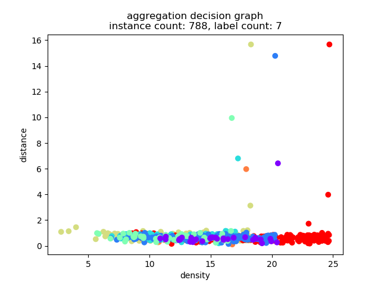
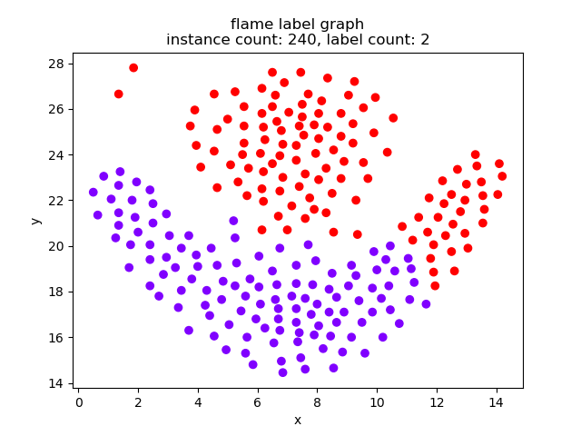
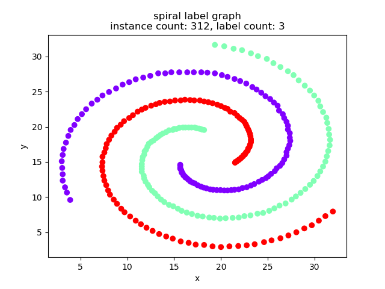

# density peak clustering algorithm

python implement with sklearn manner.

## document

### overview

``` python
class DensityPeakCluster(object):
    """
    Density Peak Cluster.

    Methods:
        fit: fit model
        plot: plot clustering

    Attributes:
        n_id: data row count
        distance: each id distance
        dc: threshold of density cut off
        rho: each id density
        nneigh: each id min upper density nearest neighbor
        delta: each id min upper density nearest neighbor distance
        labels_: cluster labels_
        center: center id
    """
```

### construct method:

``` python
def __init__(self,
             dc=None,
             distance_metric='euclidean',
             silence=True,
             gauss_cutoff=True,
             density_threshold=None,
             distance_threshold=None,
             anormal=True):
    """
    Init parameters for Density peak cluster.

    parameters
    :param dc: local density threshold, None for default select, 'auto' for auto select
    :param distance_metric: distance calculate function, include euclidean, cosine, pearson
    :param silence: print process log
    :param gauss_cutoff: neighbor cutoff function, True for gauss, False for hard cutoff
    :param density_threshold: density threshold to filter center, None for auto
    :param distance_threshold: distance threshold to filter center, None for auto
    :param anormal: differ anormal point to -1
    """
```

### fit method:

``` python
def fit(self, data):
    """
    Fit model.

    :param data: data for cluster
    :return: None
    """
```

### plot method:

``` python
def plot(self, mode="all", title="", **kwargs):
    """
    Plot cluster.

    :param mode: "decision" to plot decision graph,
        "label" to plot label graph, "all" to plot decision and label graph.
    :param title: title to plot
    :return: None
    """
```

### example:

``` python
"""example of density peak cluster algorithm."""
import pandas as pd

from dpca import DensityPeakCluster

# file name
file = "spiral"

# load data
data = pd.read_csv(r"data/data/%s.txt" % file, sep="\t", header=None)

# dpca model
# plot decision graph to set params `density_threshold`, `distance_threshold`.
dpca = DensityPeakCluster(density_threshold=8, distance_threshold=5, anormal=False)

# fit model
dpca.fit(data.iloc[:, [0, 1]])

# print predict label
print(dpca.labels_)

# plot cluster(all to plot decision graph and label graph)
dpca.plot("all", title=file, save_path="data/result")
```

### NOTE

you should plot decision graph to set params `density_threshold`, `distance_threshold` first.

### reference

- [dpca paper](http://science.sciencemag.org/content/344/6191/1492.full)
- [dpca github](https://github.com/colinwke/DensityPeakCluster)

### cluster result

aggregation




jain


flame




spiral


